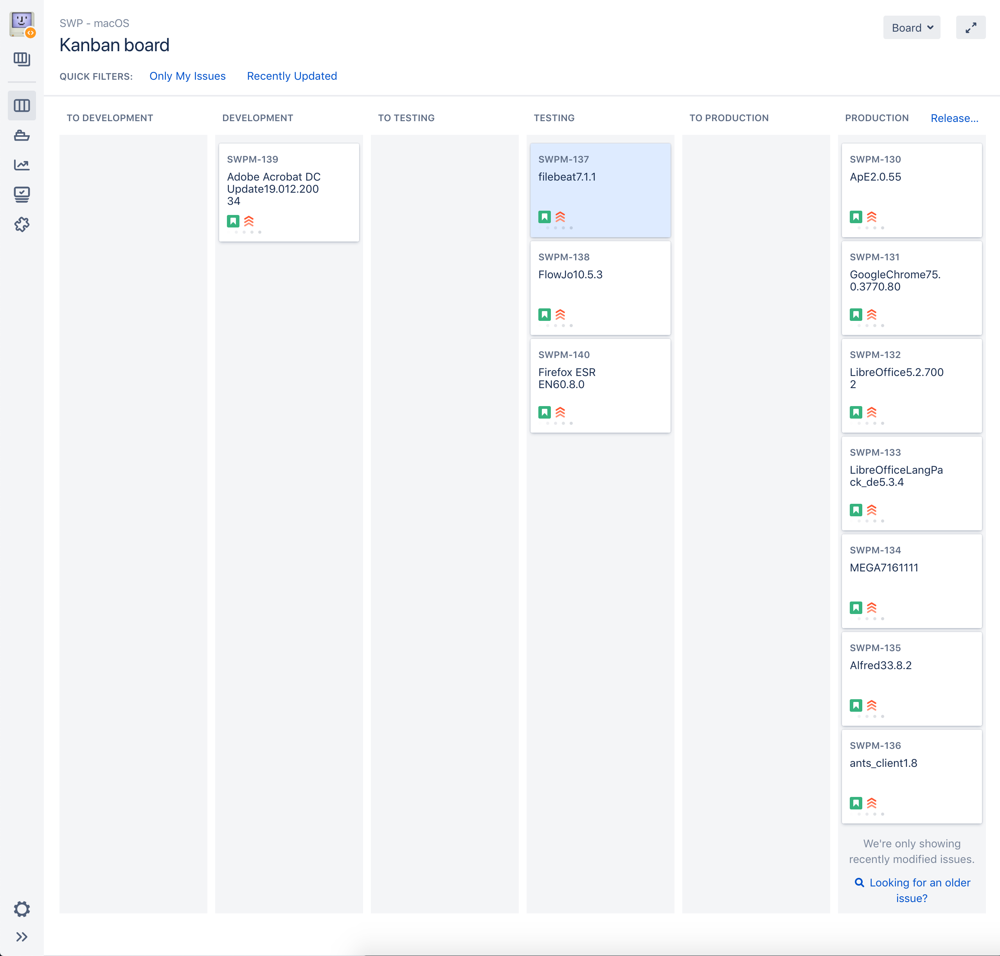
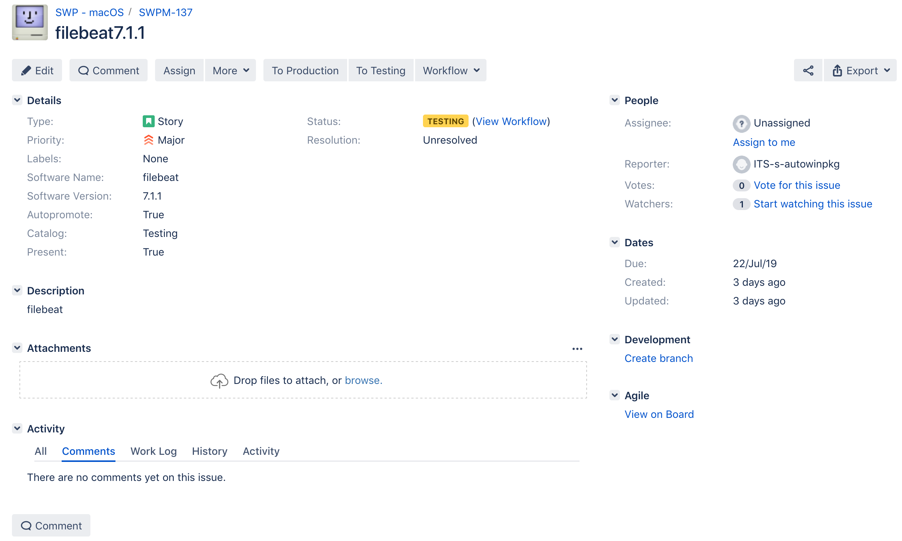
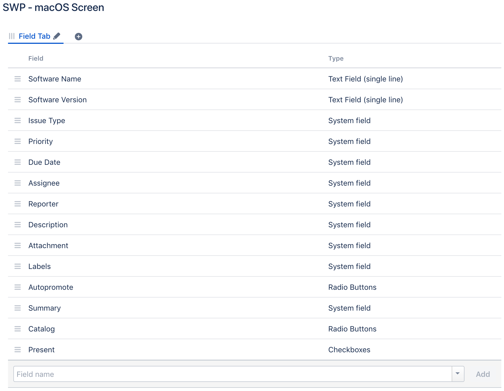
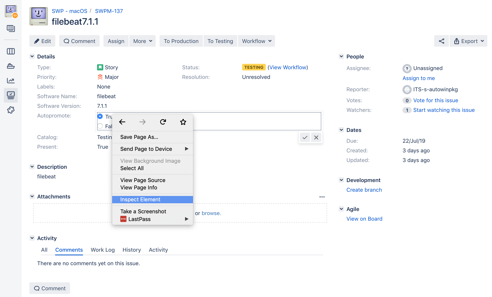
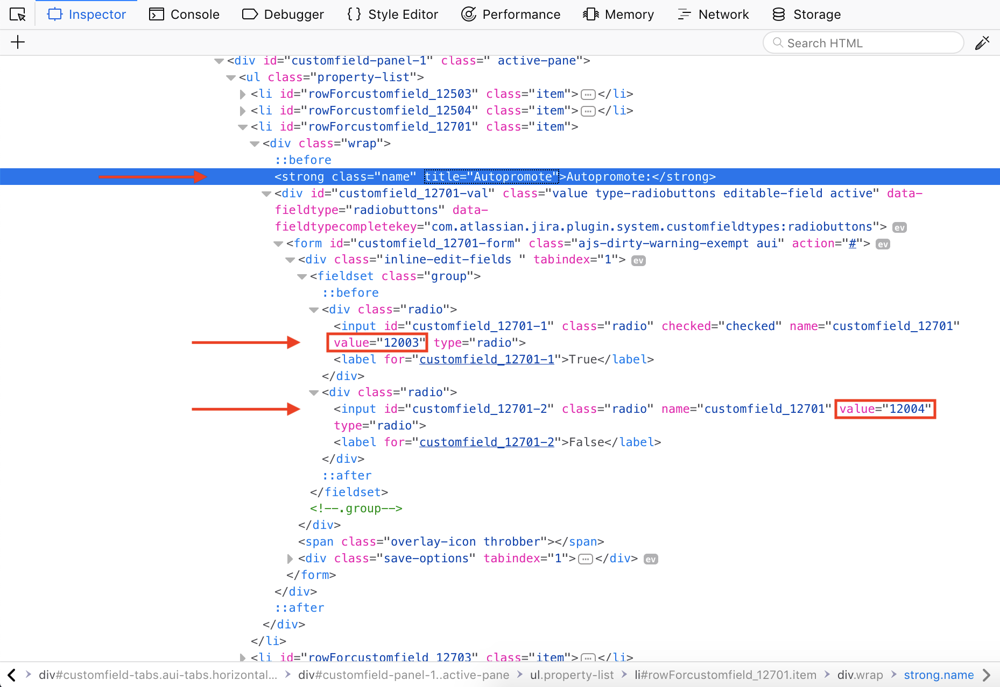
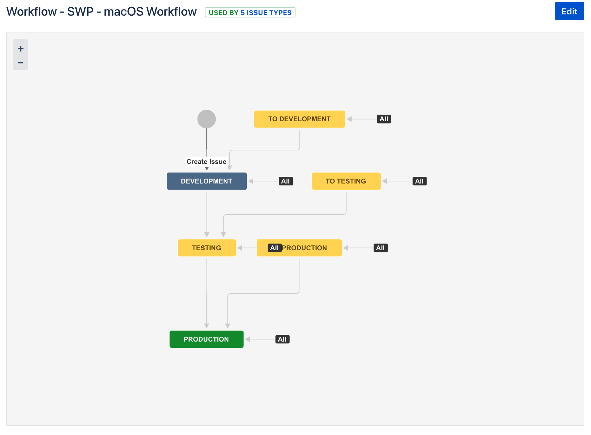
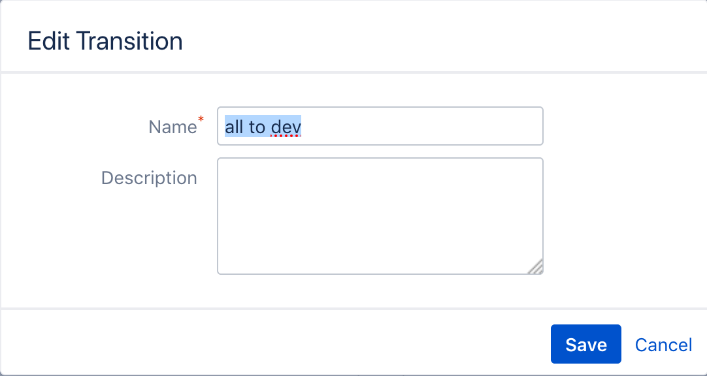

Configuration
=============

.. toctree::
   :maxdepth: 3

   ini-config

To make it as easy as possible for someone new to setup his instance of
*Munki Promoter* all configuration values are stored in one file, the ``default.ini`` file. This means in
theory that the average user does not need to touch any of the other files in
this repository. To change the value, simply find the correct variable assignment.

In the config file 4 different config sections exist:

 - **Promotion**: These variables define, how often and when your packages are automatically promoted
 - **Munki**: These variables have information about the location and the structure of your munki repository
 - **Jira**: These variables are used to connect to the correct Jira instance and additionally all required
   information about your Jira configuration can be set here, including the jira internal names of the fields.
 - **Logger** These variables define your logger configuration.

An example for the ``JIRA_AUTOPROMOTE_FIELD`` is shown below. The different sections inside this config file
have an information if they must be changed, but some of the default values have to be adapted to your project,
especially the information about the jira project.

There is additionally another way to set the config values in case you are using some sort of
virtual environment or a configuration management tool such as ANTS_.
You can just set the environment variables with the name as in the ``default.ini`` file and a ``MUNKIPROMOTER_``
appended to the front.
So if you want to set the config variable ``REPO_PATH``, it has to be named ``MUNKIPROMOTER_REPO_PATH`` in
your environment.
Using this approach no files need to be edited at all and it is unlikely that any existing environment variables
get overwritten.

.. code-block:: ini

   JIRA_AUTOPROMOTE_FIELD = customfield_12701

.. warning::
   Virtual environments will most certainly have **no** or **other** environment
   variables than your *normal* session. Therefore make sure that you set the
   variables in the correct environment. For example first activate your
   virtualenv before setting the values.

.. _ANTS: https://github.com/ANTS-Framework/ants

Set up Jira Board
-------------------------

This is an example on how your Jira Board and Issue should look like. Minor
differences are of course possible (especially with future updates), but the
core components should be present.

Required Issue fields
---------------------

For the *Munki Promoter* to work properly, we need a minimum set of system and
custom fields for our Jira Issue Type. These fields should be added to the
`Create`, `Edit` and `View` screen in your Jira project configuration.

The fields we need are the following:

- Software Name
- Software Version
- Due date
- Catalog
- Autopromote
- Present

Below you can see an example of such an screen with the fields we need to add
and **most importantly for you** the type of field. These types are critical to the
proper out of the box functioning. In case the types you want to use, differ
from the ones shown below, you need to manually adjust the
:meth:`core.provider.jiraprovider.JiraBoardProvider.commit` method.

.. _find-custom-fields:

Find Jira Customfields
----------------------

For the configuration stored in :class:`utils.config.MunkiPromoterConfig` we
need to know the name of each customfield and the corresponding ID of the
possible values. This information can unfortunately not be queried
automatically in an easy way yet. Therefore one must open a Jira Issue in his
favourite Web Browser (below we used Firefox) and extract these information from
the html source.

Select a field you want to collect the information for and click on the edit
button of this field to change its value. **Before** actually changing the value
you can then right-click on one of the values and open your developer view
(for Firefox the tool is called Inspector). In the screenshot below you can then
see the following three information we need in case of the `Autopromote` field.

- field name: ``customfield_12701``

- radio option one: ``12003``

- radio option two: ``12004``

These information can now be added to the :mod:`utils.config`. For this example
you would need to set the following configuration options:

- ``JIRA_AUTOPROMOTE_FIELD`` to ``customfield_12701``
- ``_JIRA_AUTOPROMOTE_TRUE`` to ``12003``
- ``_JIRA_AUTOPROMOTE_FALSE`` to ``12004``

.. _jira-workflow:

Jira Workflow & Transitions
----------------------------

In the picture above you can see the workflow we utilize by default. Important
to note is that *Munki Promoter* expects three main states like
*Development, Testing* and *Production* and in addition to this we also need to
have three more lanes starting with ``TO``. These lanes are used to tell
*Munki Promoter* to move all issues within this lane to the next catalog.
As an example we may have Firefox in version 68 in our `Testing` lane. Because
we want to immediately move it to production instead of waiting for the usual
period of time we manually grab the Jira Issue and Drag-and-Drop it into the
``TO  PRODUCTION`` lane and the next time the promoter runs it will promote the
package to the `production` catalog.

.. note::
   It must be possible to move a ticket from one lane to all other lanes in the
   project. You can also see this in our workflow were each state is reachable
   by its previous and by `ALL`.

Additionally we need to know the name of each transition to be able to execute
it. You can find and edit these names if you enter the edit mode of the
workflow, click on a transition (e.g. `ALL` to testing) and then on `Edit`.
Next you should see a screen like shown below.

Insert into configuration
-------------------------

Once you collected all required configuration values you can either set the
environment variables or edit the :mod:`utils.config` file. From now on
everything should be setup and configured in a way such that you can start
the *Munki Promoter* for its initial run.